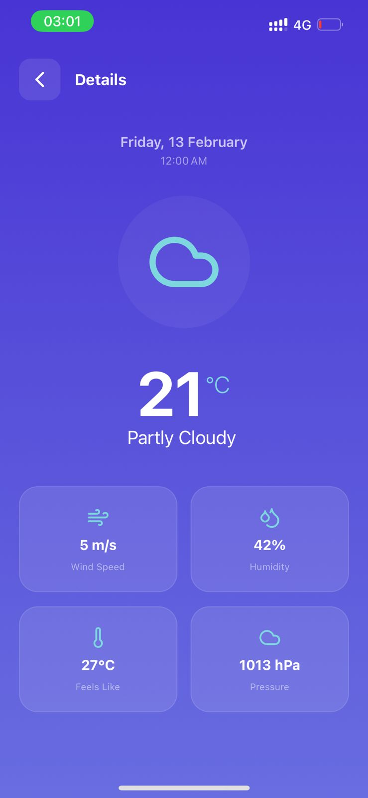
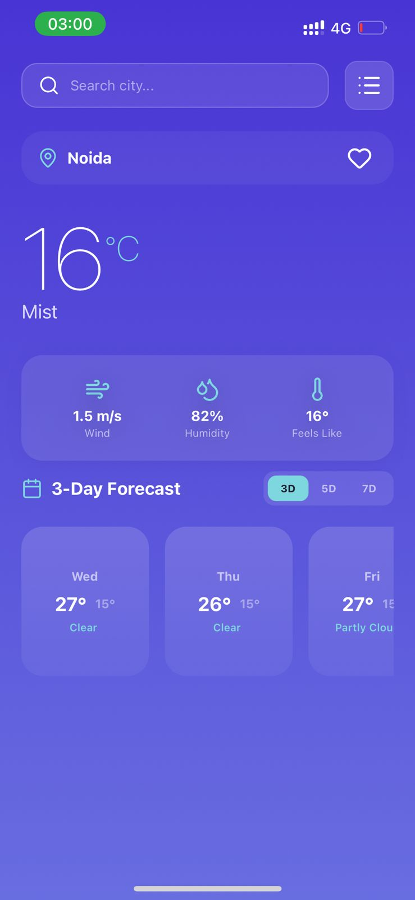
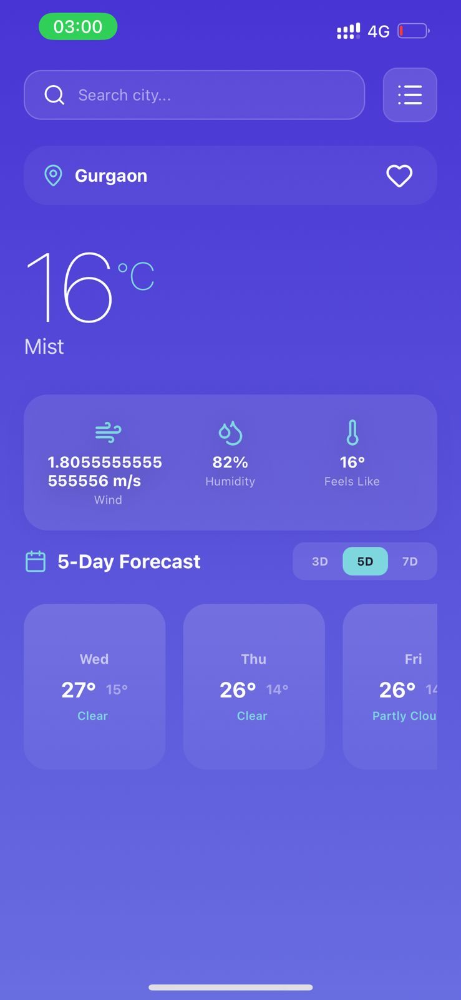
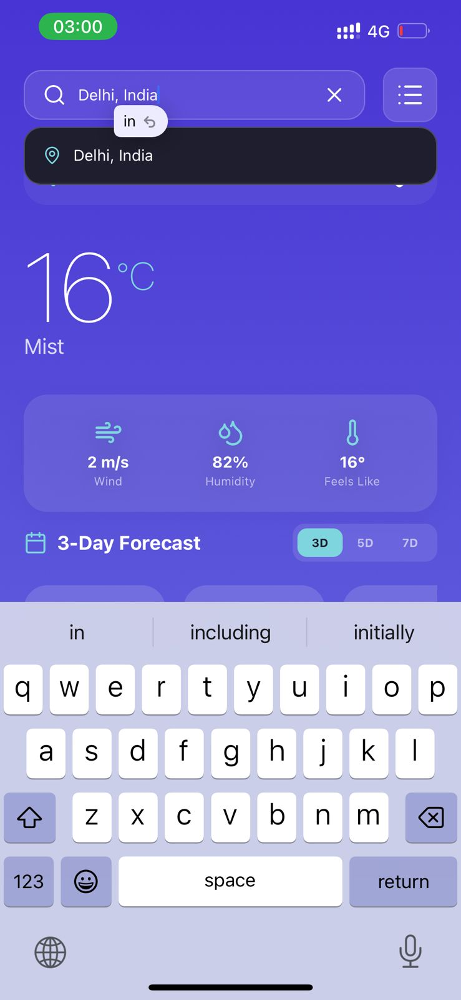
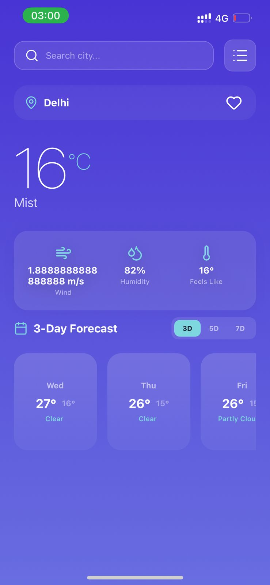
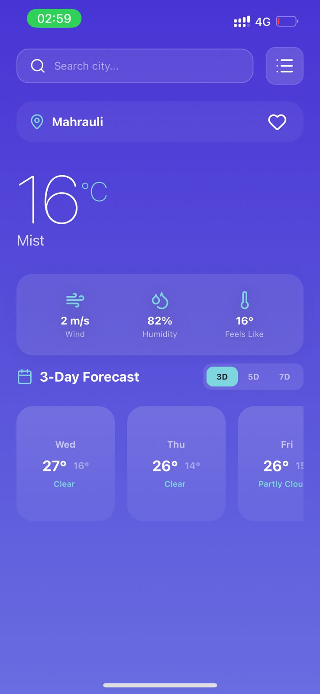

# 🌦️ React Native Weather App

A beautiful, modern, and feature-rich weather application built with **React Native** and **Expo SDK 54**. This app provides real-time weather updates, predictive search, and a premium user experience with elegant glassmorphism aesthetics.

## 📱 App Previews

<p align="center">
  
  
  
</p>
<p align="center">
  
  
  
</p>

---

## ✨ Key Features

- **🔍 Smart Search & Autosuggest**: Real-time city suggestions as you type, powered by WeatherAPI.com.
- **⭐ Favorites Management**: Save and manage your most-visited cities with a single tap. Persistent storage ensures your favorites are always there.
- **📍 Geolocation**: Automatically detects your current location to provide instant local weather on startup.
- **📅 Extended Forecast**: View weather breakdowns for 3, 5, or 7 days, including temperature ranges and atmospheric conditions.
- **💎 Premium UI/UX**: Stunning visuals featuring vibrant gradients, glassmorphism components, and smooth animations using Reanimated 4.
- **💾 Persistent State**: Your search history and favorite cities are saved locally using Redux Persist and AsyncStorage.

## 🛠️ Tech Stack

- **Core**: [React Native](https://reactnative.dev/) & [Expo](https://expo.dev/) (SDK 54)
- **State Management**: [Redux Toolkit](https://redux-toolkit.js.org/) & Redux Persist
- **Navigation**: [React Navigation](https://reactnavigation.org/)
- **Icons**: [Lucide React Native](https://lucide.dev/)
- **Styling**: [Expo Linear Gradient](https://docs.expo.dev/versions/latest/sdk/linear-gradient/)
- **API**: [WeatherAPI.com](https://www.weatherapi.com/)
- **Networking**: [Axios](https://axios-http.com/)

---

## 🚀 Getting Started

### Prerequisites

- [Node.js](https://nodejs.org/) (LTS)
- [Expo Go](https://expo.dev/client) app on your iOS or Android device

### Installation

1. **Clone the repository**
   ```bash
   git clone https://github.com/doniakth/React-Native-Weather-App.git
   cd React-Native-Weather-App
   ```

2. **Install dependencies**
   ```bash
   npm install --legacy-peer-deps
   ```

3. **Start the application**
   ```bash
   npx expo start
   ```

4. **Run on your device**
   Scan the QR code displayed in your terminal using the Expo Go app (Android) or the Camera app (iOS).

---

## 📄 License

This project is open-source and available under the MIT License.

## 👤 Author

**Donia**
- GitHub: [@doniakth](https://github.com/doniakth)

---
<p align="center">Made with ❤️ for a better weather experience</p>
